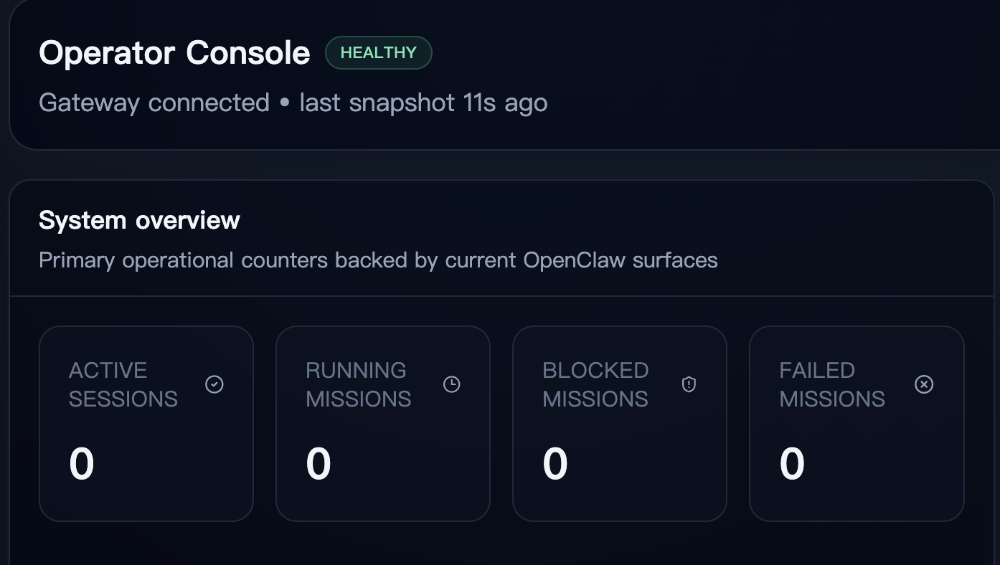
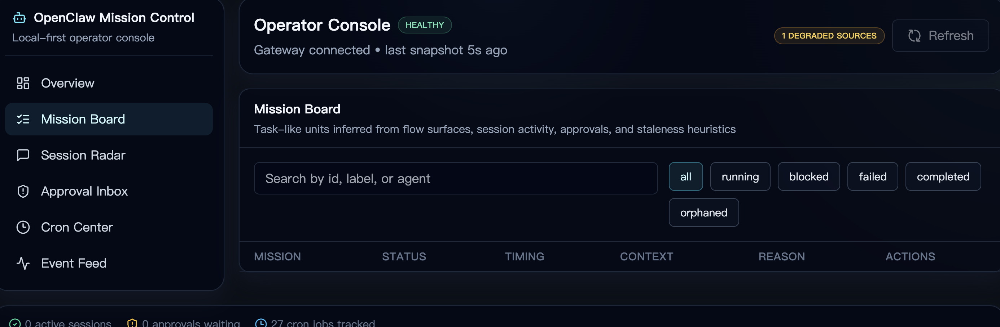

# 安装说明

本文档面向第一次下载 OpenClaw Mission Control 的使用者，帮助你在本地启动、连接真实 OpenClaw，并理解常见降级提示。

## 系统要求

- Node.js 20 或更新版本
- npm 10 或更新版本
- 本地可运行的 OpenClaw CLI
- 可访问的 OpenClaw Gateway

## 安装步骤

### 克隆项目

```bash
git clone https://github.com/youwenkui/openclaw-mission-control.git
cd openclaw-mission-control
```

### 安装依赖

```bash
npm install
```

### 配置环境变量

```bash
cp .env.example .env.local
```

推荐最小配置：

```env
OPENCLAW_GATEWAY_URL=ws://127.0.0.1:18789
OPENCLAW_GATEWAY_TOKEN=
OPENCLAW_CLI_PATH=openclaw
OPENCLAW_POLL_INTERVAL_MS=5000
OPENCLAW_ENABLE_CLI_FALLBACK=true
OPENCLAW_ENABLE_LOCAL_CACHE=false
OPENCLAW_MOCK_MODE=true
```

## 启动

开发模式：

```bash
npm run dev
```

生产构建：

```bash
npm run build
npm run start
```

## 首次打开后你会看到什么

### 健康

- 表示关键数据面当前可达
- 如果有可选 surface 不支持，会单独标记 unavailable 或 degraded

### 降级

- 表示至少一个关键 surface 当前不可用
- 常见原因是 Gateway 握手失败、CLI 不支持某个方法、cron surface 暂时无响应

### 模拟模式

- 表示 live OpenClaw 数据面不可用，系统自动回退到了 mock seed 数据
- 这适合前端开发，不适合真实运维判断

## 截图

### 总览页



### 任务看板



## 常见问题

### 打开后没有任务

先确认你的 OpenClaw runtime 是否真的支持 `flows`。如果不支持，Mission Control 会退回到 session 推断模式。

另外也要确认：

- `openclaw sessions --all-agents --active 1440 --json` 是否有返回数据
- Gateway 是否正常连接
- 当前页面是否已经强制刷新

### Cron 状态全是未知

这通常说明你的 runtime 返回的 cron 状态对象里只有 `nextRunAtMs`，没有 `lastStatus` 或 `lastRunStatus`。这类情况下 UI 会诚实显示 `未知`，而不是伪造状态。

### 插件审批显示 unavailable

某些 OpenClaw runtime 不支持 `plugin.approvals.get`。这不影响主控制台工作，只意味着该能力当前无法从你的网关读取。

### 3000 端口打不开

Next.js 会在端口冲突时自动切换到其他端口。请看终端输出里的实际地址。
